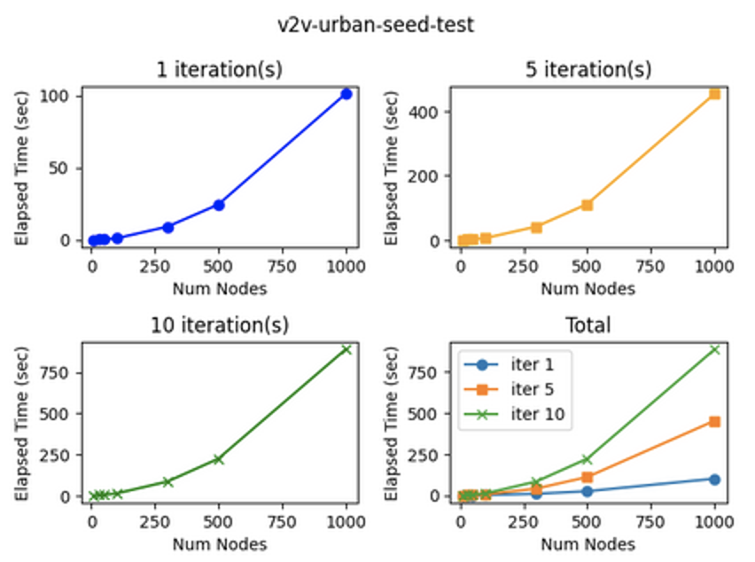
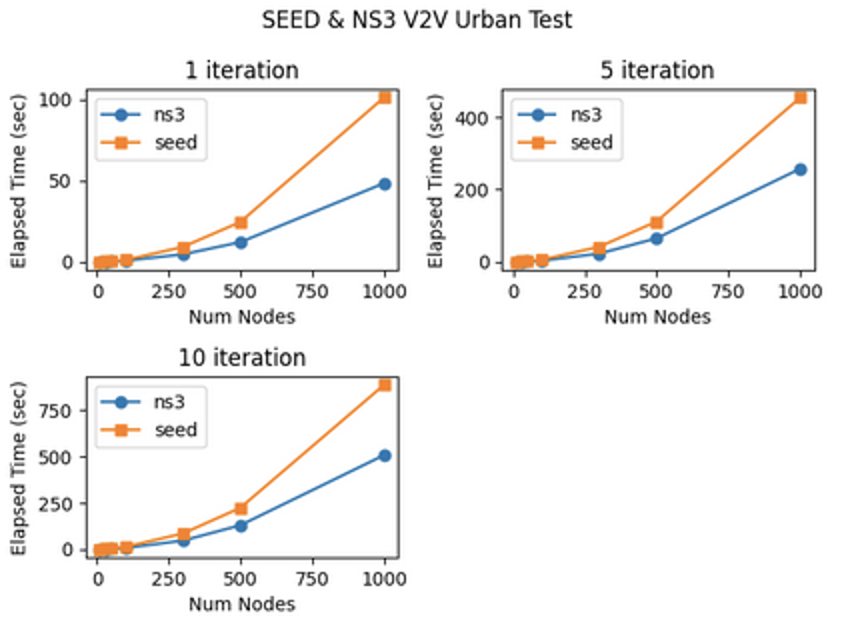
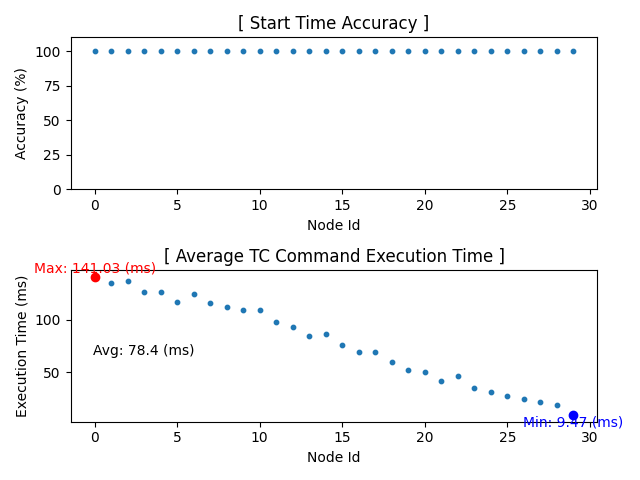
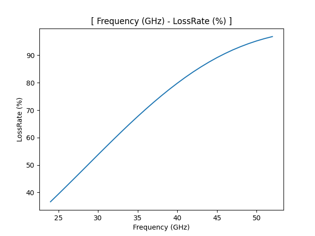
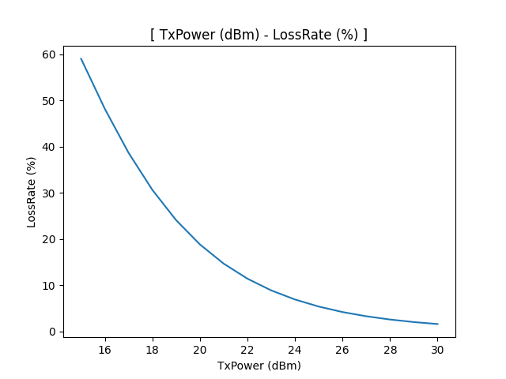

# Experiment Report: Network Simulation Validation

## 1. Introduction

### 1.1 Background

The main role of the `SEED-Simulator` is to control the network flow between nodes powered by the seed emulator. The current `SEED-Simulator` supports several network propagation models, and it also supports some topologies to easily configure the movement of nodes.

In `SEED-Simulator`, there are two main settings: (1) `MobilityModel` and (2) `PropagationLossModel` for nodes. Through a specified number of iterations, the simulation updates the positions of nodes based on the configured mobility model and calculates the network loss between nodes according to the propagation loss model. The data produced by SEED-Simulator is processed and used by SEED-Emulator and the Viewer.

### 1.2 Objectives

Through these experiments, we aim to validate the effectiveness of the SEED Simulation's propagation loss model. Firstly, we will assess whether the calculation of the loss rate in the propagation loss model within the simulation is sufficiently efficient in terms of time. Additionally, we will verify whether the loss rate calculated through simulation is applied to the emulator within a reasonable timeframe. Secondly, we need to validate whether the propagation loss model itself is computed as expected. This validation will be conducted by comparing the results with the ns3 network simulation experiments. Thirdly, it is essential to verify the successful application of emulation. This involves confirming whether routing information appropriately adjusts in response to changes in the loss rate.

<!-- ## 2. Methodology

### 2.1 Simulation Environment

Describe the simulation environment, including any specific settings, configurations, or parameters used.

### 2.2 Experimental Design

Outline the design of the experiments. Specify the variables you manipulated and the measurements or observations collected. -->

## 2. Experiments

### 2.1 Experiment 1: Propagation Loss Model Calculation Speed Verification

#### 2.1.1 Purpose

The primary objective of this experiment is to assess the efficiency of the propagation loss model calculation speed within the SEED Simulation. Specifically, we aim to determine if the loss rate calculations are performed rapidly enough from a time efficiency perspective.

#### 2.1.2 Procedure

The experiment was conducted in a Parallels VM environment with 16GB of memory. The chosen propagation loss models for the SEED Simulation are the ThreeGppV2vUrbanPropagationLossModel and ThreeGppV2vHighwayPropagationLossModel. Nodes were configured to move at each time step to simulate dynamic scenarios. The loss rate between all nodes was recalculated at each time step to adapt to changing network conditions. To optimize computational efficiency, the current utilized the numpy Python library.

This experiment was conducted using simulation.py and analysis.py, both of which can be found at the following path:
- wireless/SEED-Simulator/experiments/experiment-01

In simulation.py, experiments were carried out by varying the number of nodes, the iteration count, and the propagation loss model to consider multiple scenarios. More specifically, the number of nodes could take values of 10, 30, 50, 100, 300, 500, and 1000, while the iteration count could be 1, 5, or 10. The propagation loss model could have either ThreeGppV2vUrbanPropagationLossModel or ThreeGppV2vHighwayPropagationLossModel.

Upon executing simulation.py, the execution times for each scenario are recorded in CSV format. Subsequently, running analysis.py allows for visualizing the log values as plots.

#### 2.1.3 Results

Figure 1, labeled as exp1-fig1, illustrates the time taken to calculate the loss rate during the given iterations (time steps). The x-axis represents the number of nodes, while the y-axis denotes the computation time. [1 iteration(s)] In the graph, when there are 500 nodes, the calculation of the loss rate takes approximately 25 seconds. In contrast, when there are 1000 nodes, double the previous quantity, the computation time increases to around 100 seconds, approximately four times higher. This observation suggests that as the number of nodes increases, the computation time for calculating the loss rate between nodes not only linearly but geometrically grows. [Total] The graph labeled as "Total" consolidates the computation times over N iterations. It shows that as the number of iterations increases, the time does not proportionally decrease or increase; rather, the time required for N iterations is N times the single iteration time.

Figure 2, labeled as exp1-fig2, presents a graph comparing the computation time with NS3 Simulation. It is evident from the graph that NS3 exhibits approximately 2 times faster computation time compared to SEED Simulation. This difference is attributed to the inherent speed gap resulting from the fact that NS3 is developed in C++, while SEED Simulation is developed using the Python language.

In the current implementation, there is no real-time synchronization between simulation and emulation. Therefore, the current level of computation speed does not significantly impact the system. Even if real-time synchronization were to be implemented, it is believed that the current computation speed is sufficient for development. However, a thorough examination through future development is required to validate this assumption. Furthermore, there is still room for improvement in computational speed algorithmically.

### 2.2 Experiment 2: Verification of Loss Rate Application Speed

#### 2.2.1 Purpose

The main purpose of this experiment encompasses two key objectives. Firstly, to verify whether the loss rate for each node during a given iteration is appropriately configured, and secondly, to validate whether the time taken for configuring the loss rate is sufficiently short.

The first objective aims to ensure the synchronization of simulation times across all nodes. The values obtained from the simulation take the form of statements like "At iteration N, the loss rate between node I and node J is a%." To apply this information to the emulation, we need to convert iteration details into a time format. This conversion is achieved through the following algorithm.

Given the start time, which is the commencement of the simulation, and the iteration duration, which is the time each iteration persists, we can calculate the time for each iteration. For instance, if the start time is 10:30:10, and the iteration duration is 1 second, the times for iterations 1 to 5 would be as follows:

- Iteration 1 - 10:30:10
- Iteration 2 - 10:30:11
- Iteration 3 - 10:30:12
- Iteration 4 - 10:30:13
- Iteration 5 - 10:30:14

It is essential to avoid a scenario where, at 10:30:11, Node 1 references iteration 2, and Node 2 references iteration 3.

The second objective involves verifying whether the time taken for the application of loss rates is sufficiently short. This entails confirming that the 'tc' command execution time is efficient. If this time is not adequately short, it can adversely affect simulation efficiency, making it crucial to validate its adequacy.

#### 2.2.2 Procedure

The experiment setting is as follows:

1. Propagation loss model: Adopt the ThreeGppV2vUrbanPropagationLossModel.
2. Mobility model: Utilize the ConstantVelocityMobilityModel, allowing all nodes to move at arbitrary velocities each iteration.
3. Set the total number of iterations (time steps) to 30, and the total number of nodes to 30.

Upon executing the sim-driver.sh script, the simulation begins 10 seconds after the script execution, and information on the desired start time, current time, and elapsed time is logged for each iteration. The log files can be found in /tmp/seedsim/tc_command/{node_id}/test_result.

- `desired_time`: The intended time for the 'tc' command to execute.
- `current_time`: The actual time when the 'tc' command is executed.
- `elapsed_time`: The duration it takes for the 'tc' command to complete.

By comparing `desired_time` and `current_time`, we can ascertain whether the 'tc' command executes at the intended time. Additionally, `elapsed_time` provides insights into the duration of 'tc' command execution.

The analysis.py script, located in seedblock/wireless/SEED-Simulator/experiments/experiment-02/, processes this information from the logs and generates plots for further analysis.

#### 2.2.3 Results

##### Start Time Accuracy

Start time accuracy indicates the percentage of instances where `desired_time` and `current_time` match. The experimental results show that start time accuracy is recorded as 100% for all nodes. This implies that the 'tc' command is executed correctly at the specified time.

##### Average TC Command Execution Time

The metric "Average TC Command Execution Time" represents the mean time taken for the application of the 'tc' command across each node. In the figure, the maximum value is 141 ms, the minimum is 9 ms, and the overall average is 78.4 ms.

Our goal is to move nodes and update loss rates every second. Based on this, an execution time of approximately 0.1 seconds is considered sufficiently short for conducting simulations.

An additional observation from the figure reveals that as the node ID increases, the execution time decreases. This phenomenon is attributed to the fact that as the node ID increases, the number of 'tc' rules to be applied decreases. In the current implementation, where the loss rate for node i (where i < j) is set at node i, the number of 'tc' rules to be applied decreases as the node ID increases. For instance, considering nodes numbered 1 through 30, the number of 'tc' rules to be applied at node 1 is 29, while at node 25, it is 5.

##### Conclusion

For each time step, the precomputed loss rate is applied within each node (docker container) using the 'tc' command. The host PC triggers the invocation of the 'tc' command within each Docker container. As all 'tc' commands are executed in parallel within each container, the loss rate is applied within a reasonable time frame. The orchestration of the 'tc' commands from the host PC ensures that the loss rate is efficiently applied to each container, contributing to timely emulation updates.

### 2.3 Experiment 3: Validation of ThreeGppV2vUrban Propagation Loss Model

#### 2.3.1 Background

##### mmWave

The mmWave (millimeter wave) spectrum, typically ranging from 24 GHz to 52 GHz, is commonly associated with high-frequency bands used for advanced wireless communication. Frequencies within this mmWave spectrum, such as 24 GHz, 28 GHz, 39 GHz, and others, have been allocated for 5G deployment in various countries.

The mmWave spectrum is characterized by its short wavelength, enabling it to carry large amounts of data at high speeds. This makes it well-suited for applications requiring high capacity and fast communication, such as 5G networks. However, due to the nature of millimeter waves, they have limited coverage and face challenges penetrating obstacles, making them more suitable for deployment in dense urban areas and specific regions.

In summary, mmWave frequencies, including those in the 24 GHz to 52 GHz range, play a crucial role in enabling high-capacity and high-speed communication, particularly in the context of 5G networks. Their deployment is strategic, focusing on locations with a demand for increased data capacity and speed.

##### Transmission Power

Here are some general ranges for transmit power in common wireless communication technologies:

- Wi-Fi (2.4 GHz and 5 GHz bands): Commonly ranges from around 15 dBm to 30 dBm for consumer devices.Regulatory limits may vary by country.

- Cellular Networks (3G, 4G LTE, and 5G): Transmit power levels depend on the specific frequency band and the network technology.
For example, in LTE, typical transmit power ranges from around 20 dBm to 23 dBm for user devices.

#### 2.3.2 Purpose

In the currently developed ThreeGppV2vUrban model within the SEED SIMULATOR, the configurable parameters include frequency, transmission power, node distance, and building (obstacle). We will validate the proper functioning of the propagation loss model by systematically altering these four parameters.

Generally, frequency and loss rate exhibit a direct proportional relationship. Specifically, when two nodes are aligned at the same distance, a lower frequency is expected to result in lower loss. Additionally, transmission power and loss rate have an inverse relationship, where higher transmission power tends to correspond to lower loss rates. Furthermore, we will observe the relationship between distance and loss rate, anticipating an increase in loss rate as the distance between two nodes extends.

Moreover, the presence of a building between two nodes, leading to a non-line-of-sight condition, is expected to increase the loss rate. In the current implementation, it is anticipated that the loss rate will reach 100%.

To validate these hypotheses, experiments will be conducted to assess the alignment of the model's behavior with the expected outcomes.

Furthermore, considering that the ThreeGpp Loss Propagation Model in the SEED SIMULATOR was developed with reference to NS3's ThreeGpp Loss Propagation Model, a comparative analysis of their execution results will be undertaken. This comparative analysis aims to affirm the successful development of the ThreeGpp Loss Propagation Model in the SEED SIMULATOR.

#### 2.3.3 Procedure

##### Hypothesis 1: As the frequency increases, the loss rate also increases.

To verify this, we conducted experiments by changing the frequency to the mmWave spectrum range commonly used in Cellular networks (24 GHz to 52 GHz). The loss rate was calculated and recorded while keeping the distance fixed at 30 meters and the transmission power at the default value of 16.0206.
Please refer to `wireless/SEED-Simulator/experiments/experiment-03-01/simulation-01.py` for details.

##### Hypothesis 2: As the transmission power increases, the loss rate decreases.

To test this hypothesis, we varied the transmission power within the commonly used range for Wi-Fi and Cellular networks (15 dBm to 30 dBm) while calculating the loss rate. The distance was kept constant at 30 meters, and the frequency was fixed at the default value of 28.0e9.
Please refer to `wireless/SEED-Simulator/experiments/experiment-03-01/simulation-02.py` for details.

##### Hypothesis 3: As the distance increases, the loss rate decreases.

To validate this hypothesis, we altered the distance from 10 meters to 100 meters while calculating the loss rate. The transmission power was set to the default value of 16.0206, and the frequency was fixed at the default value of 28.0e9.
Please refer to `wireless/SEED-Simulator/experiments/experiment-03-01/simulation-03.py` for details.

##### Hypothesis 4: If there is a building between two nodes, causing them to be in a non-line-of-sight condition, the loss rate is anticipated to increase.
To demonstrate this, we configured a scenario using the GridMobilityModel and ThreeGppV2vUrbanPropagationLossModel, and utilized the Visualization Tool (example/A01-visualization). In this simulation, we aimed to confirm that the loss rate increases when there is a building between two nodes. Additionally, we verified that the paths between two arbitrary nodes do not traverse through buildings.
Please refer to `wireless/SEED-Simulator/experiments/experiment-03-01/simulation-04.py` for details.

##### Comparative analysis between the execution results of NS3 and the SEED Simulator
In addition to internal validations within the SEED Simulator, we conducted a comparative analysis between the execution results of ns3 and the SEED Simulator, aiming to evaluate the accuracy of the SEED Simulator's ThreeGppV2vUrbanPropagationLossModel and ThreeGppV2vHighwayPropagationLossModel. 

The comparison methodology is as follows:
Using ns3 version 3.38 as a reference, we executed the urban and highway scenarios using the examples/channel-models/three-gpp-v2v-channel-example.cc example code. We made slight modifications to this code to log additional information into example-output.txt.

The Python script for comparing NS3 and SEED Simulator is located at `wireless/SEED-Simulator/experiments/experiment03-02/threeGppV2vPropagationLossModelTest.py`. In this script, we input the positions of the two nodes (transmitter and receiver) executed in NS3 and use the ThreeGppV2vUrbanPropagationLossModel and ThreeGppV2vHighwayPropagationLossModel to compare Channel State and Path Loss information for each simulation time.

#### 2.3.4 Results

##### Hypothesis 1: As the frequency increases, the loss rate also increases.

Hypothesis (1) holds true.

##### Hypothesis 2: As the transmission power increases, the loss rate decreases.

Hypothesis (2) holds true.

##### Hypothesis 3: As the distance increases, the loss rate decreases.

Hypothesis (3) holds true.

##### Hypothesis 4: If there is a building between two nodes, causing them to be in a non-line-of-sight condition, the loss rate is anticipated to increase.

Hypothesis (4) holds true.
When there is a building between two nodes, the condition of LOS between two nodes is NLOS and the loss rate is 100%.
Figure 3 in Experiment 3 (exp3-fig3) illustrates the paths from all nodes to the red node, namely router-16. As evident, there are no paths that traverse through the buildings. However, it is observed that there are paths leading from inside the buildings to the outside. This occurrence is attributed to the fact that communication developments for scenarios like O2I (Outside to Inside) and I2O (Inside to Outside) within the buildings have not been implemented yet.

##### Comparative analysis between the execution results of NS3 and the SEED Simulator
The comparative analysis revealed that the execution results of NS3 were consistent, confirming that the propagation loss model operates as expected. However, it is important to note two limitations in this comparison.

Firstly, NS3 calculates path loss through the loss model, while the SEED Simulator computes loss rate instead of path loss. Since path loss and loss rate are not directly comparable, we addressed this limitation by indirectly calculating path loss, a precursor to loss rate calculation, based on the method used in the SEED Simulator. We then compared it with NS3's execution results.

Secondly, when the ChannelState is NLOS or NLOSV, NS3 uses its own random function to calculate the loss value, potentially leading to different loss results. In the current comparative analysis code, we compare the channel state at each simulation time and specifically compare the loss values when the channel state is LOS.

### 2.4 Experiment 4: Verification of Routing Information Variation between Nodes with Changing Loss Rate

#### 2.4.1 Purpose

The objective is to validate the alteration of routing information between nodes as the loss rate changes.

Experiments will be conducted to observe and verify whether modifications in the loss rate result in corresponding adjustments to the routing information between nodes. This verification process aims to ensure that the network's routing dynamics appropriately respond to variations in the loss rate.

#### 2.4.2 Procedure

Document Needed.
Will provide test codes.

#### 2.4.3 Results

## 3. Conclusion

## 4. Future Work

- Loss Rate Calulation Algorithm Improvement
